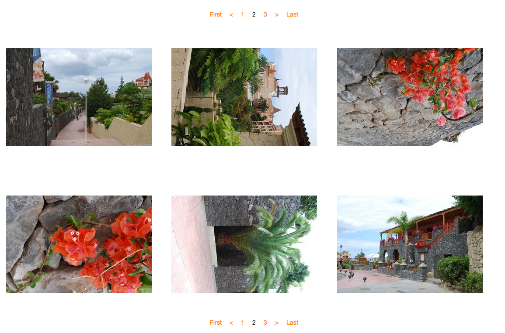

.. ==================================================
.. FOR YOUR INFORMATION
.. --------------------------------------------------
.. -*- coding: utf-8 -*- with BOM.

.. include:: ../Includes.txt

.. _introduction:

Introduction
============

.. _what-it-does:

What does it do?
----------------

Simple FileCollection Gallery renders a FileCollection containing static images or folder based images.
It provides a simple layout with pagination and a lightbox.
Based on fluid templating the frontend layout can be edited fast and easy.

Since this gallery renders a set of files of a file collection it may render something else than an image gallery,
depending on the provided template. (e.g. List of downloadable files).

You are now able to access the settings in the "appearance tab" of the plugin via "contentObjectData". ( Thanks to https://github.com/justonestep )
It is now possible to create nested galleries, with the first image as preview image. ( Thanks to https://github.com/Ferhat67 )

.. _screenshots:

Screenshots
-----------

.. figure:: ../Images/screenshot-plugin.png
   :width: 500px
   :alt: Backend Plugin

   This is the plugin for the backend

   This is a screenshot taken in the Introduction Package after installation and increasing image size.

Credits
-------

This extension uses some third party code.

`Array Pagination Widget <http://blog.teamgeist-medien.de/2014/01/extbase-fluid-widget-paginate-viewhelper-mit-array-unterstuetzung.html>`_
	An Array Pagination Widget provided by Paul Beck and Armin Ruediger Vieweg

`IncludeFileViewHelper <https://github.com/georgringer/news>`_
	A ViewHelper for including the css file via the extension layout, provided by Georg Ringer in his news extension.
