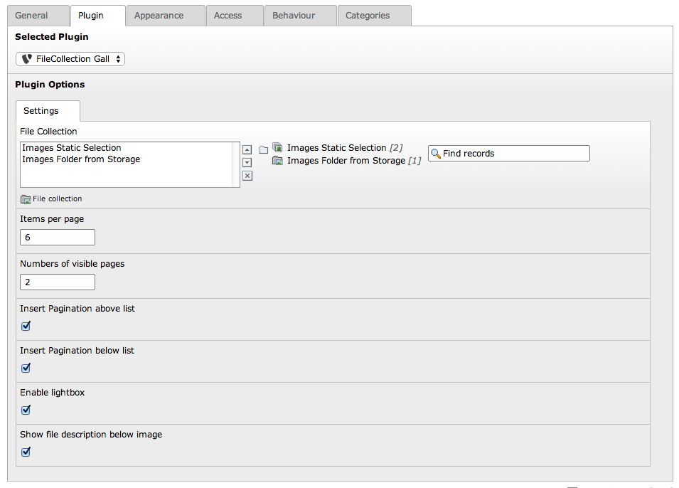

.. ==================================================
.. FOR YOUR INFORMATION
.. --------------------------------------------------
.. -*- coding: utf-8 -*- with BOM.

.. include:: ../Includes.txt

.. _user-manual:

Users Manual
============

To render a gallery from a file collection you first need to create one via Web->List on the page you want the collection to be saved.
This collection may contain either a static set of files or a folder base set of images, its your choice.

In the plugin you need to provide at least one file collection but you may add some more. The images were rendered in the order they were placed in the
file collection and in the order you sort multiple collections in the plugin.

Additionally you may enter the following settings:

- How many images should be rendered per pagination page
- How many item links should be visible in the pagination
- If the pagination should be rendered above/below the list
- If the images should be placed in a lightbox. (May depend on your global settings)
- If you provide some file description in the filelist or in the file collection, you may render this below the images.
- The sorting of the images may be ascending, descending or as given in the filecollection.

   Default Backend view

